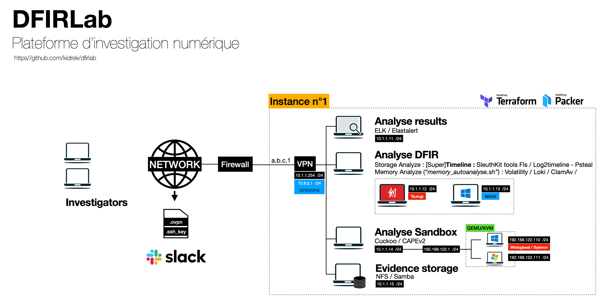

DFIRLab est une plateforme d'investigation numérique facilement déployable.

Elle est actuellement constituée :
* d'un serveur de fichier SAMBA
* d'un serveur d'analyse, contenant une instance ELK
* d'un serveur d'analyse en sandbox Cuckoo/Capev2
* de deux machines contenant des outils d'analyse Forensic, en environnement Debian et Microsoft Windows.

Les preuves sont à transférer vers le serveur de stockage (Samba). 
Une fois le transfert effectué, elles seront accessibles des autres serveurs.

!! Ce projet est toujours en cours d'élaboration !! 

## Mise en oeuvre

Il est impératif de dédier un serveur virtuel pour faciliter la génération des templates et de leur déploiement.
Les templates de machine virtuelle sont générés grâce à l'outil Packer.
Le déploiement de la plateforme est quant à lui assuré par l'outil Terraform.

### 1. Génération des templates via Packer (/packer)

L'outil Packer va permettre de générer les templates de machines virtuelles qui seront déployés par la suite par Terraform.
Avant que le processus ne soit automatisé, il est nécessaire de se placer dans le répertoire "/packer" puis dans chacun des répertoires nommés "template-XXXX" et d'y exécuter le script ```build.sh```.

Ainsi en guise d'exemple, pour générer l'image de référence Debian :

```
cd packer/template-debian10/
./build.sh
```


### 2. Déploiement de l'architecture via Terraform (/terraform)

Le déploiement de l'architecture se déroule aussi facilement que la génération des templates. Il suffit de se placer dans le répertoire "/terraform", et d'y exécuter le script ```build.sh```.
Il est impératif d'éditer au préalable les fichiers ```00_main.tf``` et ```00_variables.tf``` pour y spécifier les informations indispensables au déploiement de l'architecture.

```
cd terraform/
./build.sh
```

### Tips

Packer et Terraform utilise une connexion SSH sur les machines virtuelles nouvelles créées pour y installer des paquets ou y appliquer certaines configurations. Afin d'éviter l'attente d'une validation 'Fingerprint' durant le déploiement, j'ai du appliquer la configuration suivante :

```
# vi $HOME/.ssh/config 
Host *
  StrictHostKeyChecking no
  UserKnownHostsFile=/dev/null
  ControlMaster auto
  ControlPath /tmp/socket-%r@%h:%p
  ControlPersist 3600
```
