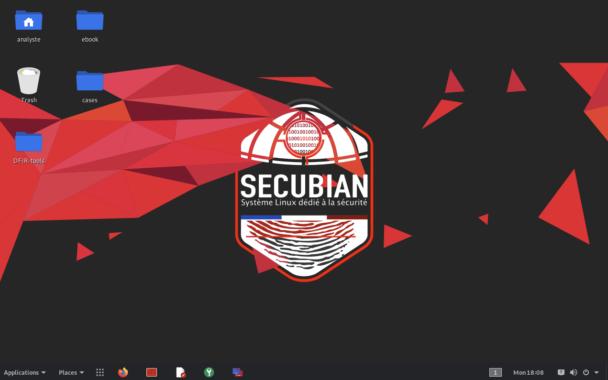
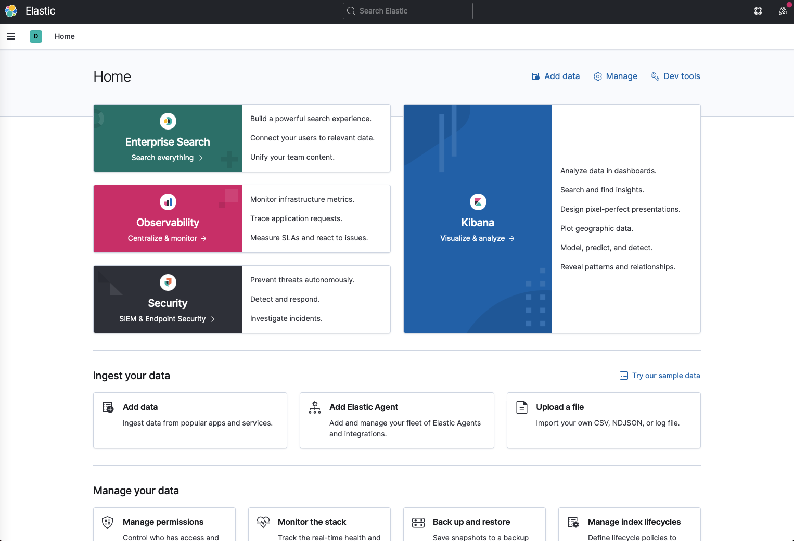
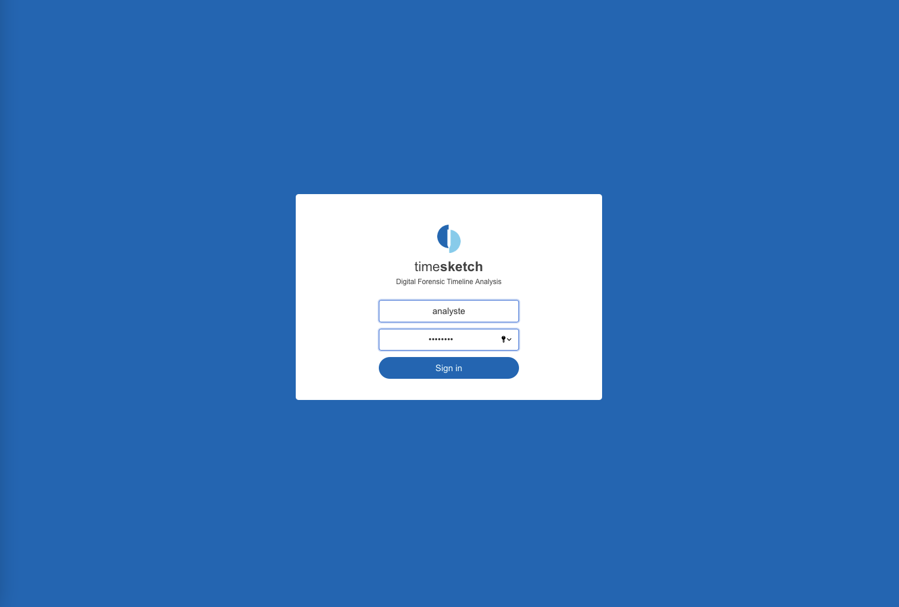
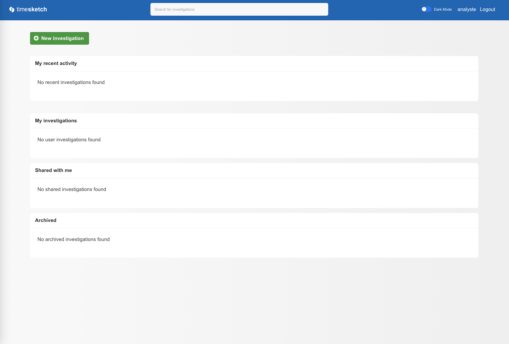
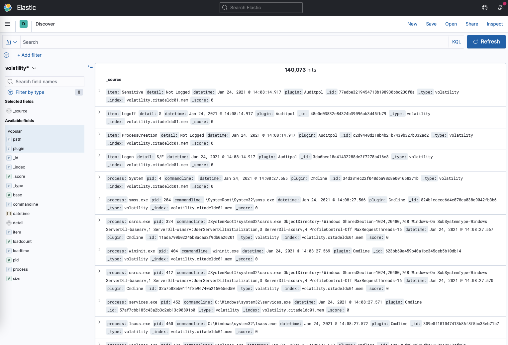
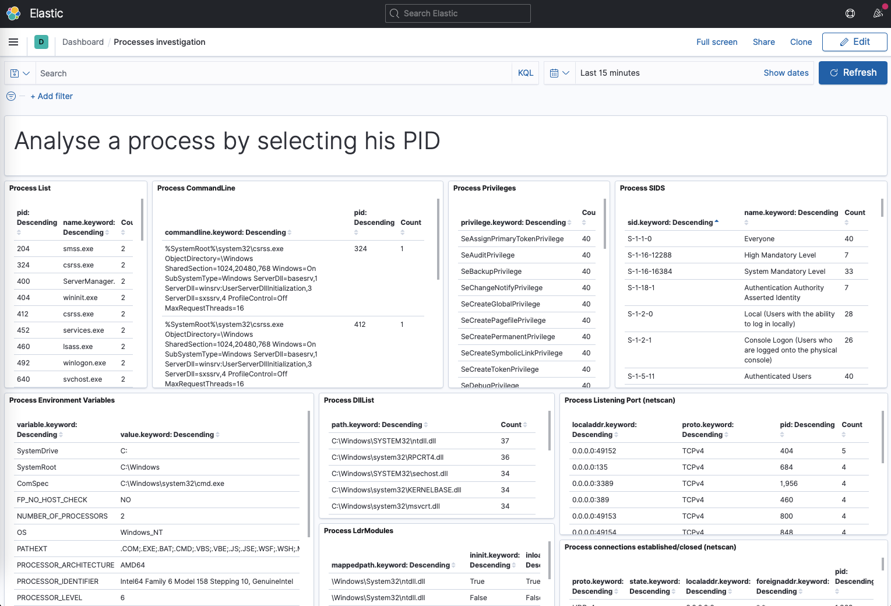
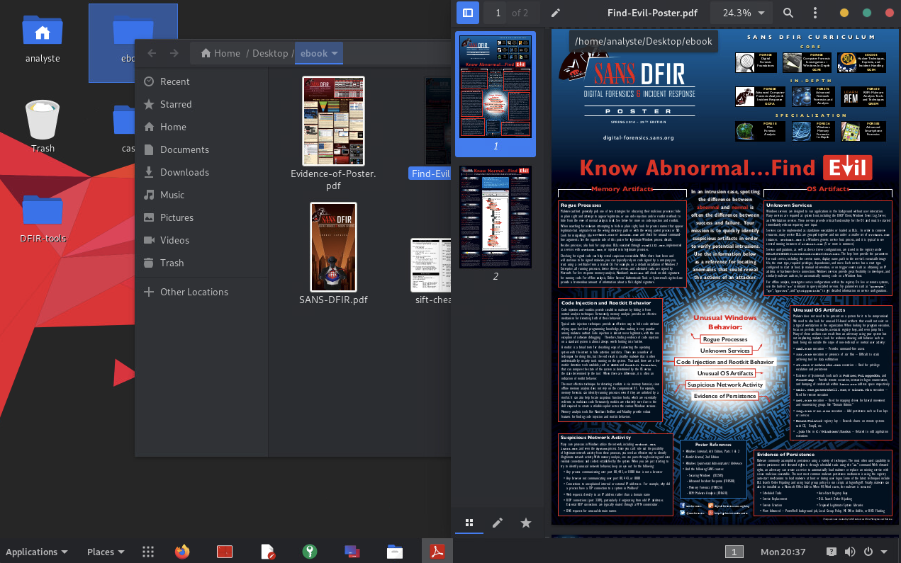

# Template / Debian10 -- with DFIR tools

Ce template a pour vocation de fournir un large éventail d’outils nécessaires pour mener une investigation numérique.
Pour ce faire, j’ai repris les bases d’un projet nommé Secubian que nous avions créé avec SecuIP, il y a quelques années maintenant.
La génération du fichier OVA correspondant à la machine virtuelle associée à ce template est réalisée suite à l'exécution du script `./build.sh`

Le système comprend sur le bureau de l'utilisateur `analyste`:

* de la documentation dans le répertoire `ebook`
* des outils spécifiques dans le répertoire `DFIR-tools` 
* un répertoire `cases` qui a pour but d'accueillir les différents prélévements (mémoire vive, mémoire de masse) à analyser.

Les informations relatives à l'authentification du compte utilisateur `analyste` sont : 

* login : `analyste`
* password : `analyste`




## Outils d'analyse de données

### ElasticSearch / Kibana

Elasticsearch est un outil performant pour ingérer et indexer un gros volume de données. Son utilisation est associée à Kibana, permettant de visualiser ces données à travers un outil de requêtage.
Cette suite logicielle a été intégrée pour permettre d’analyser les données résultantes des traitements des outils tels que Volatility ou Log2timeline/Psort.
Un dashboard dédié à Volatility a d’ailleurs été créé pour l’occasion.


```
cd /home/analyste/Desktop/DFIR_tools/docker-elk
sudo docker-compose up
```

Une fois démarrés ces différents services sont accessibles de la manière suivante : 

* Kibana est accessible à travers le navigateur `http://127.0.0.1:5601`
* Elasticsearch est accessible sur le port 9200 `http://127.0.0.1:9200`



### Timesketch

Timesketch est un outil d’investigation numérique open source et se voulant collaboratif. Il permet de traiter les événements systèmes provenant des différents prélèvements et les rendre accessibles à travers une timeline facile à analyser pour une équipe de réponse à incident.

```
cd /home/analyste/Desktop/DFIR_tools/timesketch
sudo docker-compose up
```
Il est nécessaire de créer un compte administateur avant sa première utilisation.

```
cd /home/analyste/Desktop/DFIR_tools/timesketch
sudo -u elk docker-compose exec timesketch-web tsctl add_user -u analyste -p analyste
```

Une fois démarré, le service est accessible via un navigateur : `http://127.0.0.1`.

--



## Outils d'analyse mémoire

### Script d'analyse mémoire Microsoft Windows : memory_autoanalyse.sh

L’analyse de dump mémoire est très chronophage. J’ai donc intégré au sein d’un script mon expérience reprenant les grandes étapes automatisant le traitement de ce type de prélèvement et permettant de gagner un temps précieux.
 
0. Placer vos dumps mémoire dans le répertoire dédié : `/home/analyste/Desktop/cases`.
1. Identification du profile associé au système d'exploitation correspondant au prélèvement
2. Génération d'une timeline des événements systèmes qui est une donnée indispensable pour débuter l'analyse. Une fois générée (via volatility, sleuthkit et log2timeline), celle-ci est disponible au format csv, mais également envoyée sur le serveur Elasticsearch.
3. Extraction des eventId Windows
4. Recherche d'injection de code via les plugins Malfind, Malfinddeep + Extraction de la mémoire impactée et des processus suspects
5. Extraction de la base de registre du système
6. Analyse statique des processus extraits (Capa) 
7. Analyse antivirale (Loki, ClamAV, Yara) 
8. Extraction des trames réseaux + Analyse via Suricata associé aux règles de détection Emerging Threats 
9. Exécution des différents plugins de Volatility + export possible des résultats vers un serveur Elasticsearch. Un dashboard dédié à Volatility a d’ailleurs été créé pour l’occasion.
10. Analyse avancée des privilèges des processus / des Mutex

```
cd /home/analyste/Desktop/DFIR_tools
sudo ./memory_autoanalyse.sh
```

Une fois le traitement du prélévement terminé, les données seront accessibles sous 2 formats : 

* plaintext au sein du répertoire `/home/analyste/Desktop/cases/$dumpmem.output`


* sous forme d'enregistrements au sein de kibana

 

Une ébauche de dashboard a été intégrée pour faciliter la recherche de processus suspects.

 


### Volatility

Volatility est un framework développé en python dédié à l'analyse de prélévement mémoire.


## Outils d'analyse d'images disques


### Plaso

Deux version de la suite plaso sont présentes sur le système.
La première a été déployée via le gestionnaire de paquet "APT" lors de l'installation du Meta-Paquet "forensics-full". Malheureusement, cette version est trop ancienne pour être compatible avec Timesketch. J'ai donc trouvé une alternative en intégrant une des dernières version au sein d'un Docker.
references: https://plaso.readthedocs.io/en/latest/sources/user/Installing-with-docker.html


Les cas d'usages seront les suivants : 

1. Analyse des prélévements de mémoire vive : via la version supportée par Debian
2. Analyse des prélévements de mémoire de masse : via la version docker et ainsi bénéficier d'une analyse Timesketch


```
cp /home/analyste/Desktop/DFIR-tools/malware_rules.yar . 
cp /home/analyste/Desktop/DFIR-tools/log2timeline/filter_windows.txt .

docker run -v $(pwd):/data log2timeline/plaso log2timeline --no_dependencies_check -u -q --partitions all --volumes all -z UTC --yara_rules /data/malware_rules.yar -f /data/filter_windows.txt /data/evidence.plaso /data/<evidence>
docker run -v $(pwd):/data log2timeline/plaso psort -o l2tcsv -w /data/evidence-timeline.csv /data/evidence.plaso
```

### La suite Sleuthkit

[A venir]

## Annexes / Documentation 

L'expertise du SANS est connue et reconnue. C'est pourquoi, j'ai intégré les différents posters édités par le SANS au sein de ce template.
Cette documentation est disponible `/home/analyste/Desktop/ebook`.



## Annexes / Liste d'outils spécifiques intégrés sur le système


* **APT-Hunter**
* **Beagle**
* **Bulk_extractor**
 * Bulk_extractor est un outil d'extraction de fichiers contenus au sein d'un prélévement (mémoire vive, ou mémoire de masse). Bulk_extractor est notamment utilisé dans l'analyse d'un dump de mémoire vive pour extraire les données réseaux capturées durant la phase de prélévement.  
 * lien : https://github.com/simsong/bulk_extractor
* **Capa [Docker]** 
 * Capa est un outil développé par la société FireEye et a pour but d'effectuer une analyse statique d'un binaire. J'ai intégré l'outil au sein d'un docker afin de faciliter sa mise en oeuvre et les mises à jour.
 * commande : ` `
 * lien : https://github.com/fireeye/capa
* **Clamav**
* **Elasticsearch/Kibana** / docker
* **Loki**
 * Loki est un projet développé en python dédié à la recherche d'Ioc au sein d'un système d'exploitation. 
 * commande : ``
 * lien : https://github.com/Neo23x0/Loki
* **Sigma** 
 * Sigma est un format de signature de détection dédié à l'analyse de fichiers de journalisation. Ces règles ont été intégrées sur le système pour permettre à Timesketch de détecter des évenements suspects.
 * lien : https://github.com/Neo23x0/sigma  
* **SleuthKit**
 * Sleuthkit est une suite d'outils permettant d'analyser des prélévements de systèmes d'information. Il est ainsi aisé de générer une timeline de l'activité du système de fichiers mais également d'extraire des fichiers supprimés.
 * lien : https://www.sleuthkit.org
* **Suricata**
 * Suricata est un outil dédié à l'analyse des données transitant sur le réseau. Il est associé dans sa tache par les règles fournies par EmergingThreats.
 * lien : https://suricata-ids.org  
* **Timesketch** / docker
 * Timesketch est une solution collaborative dédiée à l’analyse de timeline d’événements provenant de système d’information.
 * lien : https://github.com/google/timesketch
* **Volatility**
 * Volatility est un outil développé en python qui a pour but d'analyser un prélévement de mémoire vive.  
 * commande : `vol.py`
 * lien : https://github.com/volatilityfoundation/volatility
 * lien (plugins de la communauté) : https://github.com/volatilityfoundation/community


   